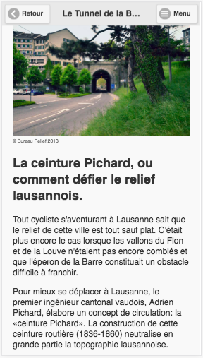

<head>
  <meta charset="UTF-8">
  <meta name="viewport" content="width=device-width, initial-scale=1.0">
  <meta http-equiv="X-UA-Compatible" content="ie=edge">
  <link rel="stylesheet" href="w3css_v4.css">
  <title>Indicateurs</title>
</head>

# **Géoguide**
## Liste des indicateurs pour les profils utilisateurs

Les indicateurs utiles à la défitinition des profils d'utilisateurs sont répartis selon quatre axes :

- **La structure** regroupe des données sociales indépendantes de l'utilisation du Géguide mais porteuses d'information sur la facilité qu'auront les utilisateurs à comprendre les informations délivrées par l'application et sur l'approche qu'ils auront face à son contenu.
- **L'implication** évalue l'intérêt de l'utilisateur pour les différents domaines exposés dans le Géoguide par le biais du nombre d'interactions qu'il effectue.
- **Les connaissances** initiales indiquent à quel point l'utilisateur est apte à recevoir des informations d'une certaine complexité. L'évaluation de ces mêmes connaissances par la suite permettent d'évaluer sa progression. 
- **La perception** renseigne sur la faculté qu'a l'utilisateur à relier les informations transmises dans le Géoguide à l'environnement dans lequel il se situe. Il s'agit d'évaluer la perception du lieu en terme de capacité de lecture du paysage et d'enregistrement de l'information relative à ce dernier.

Chacun de ces indicateurs comporte trois caractéristiques définies comme suit:

- **La temporalité** définit la fréquence à laquelle une donnée est reccueillie. Certains indicateurs sont recceuillis une seule fois à un moment précis (début/fin de parcours) alros que d'autres sont reccueillis à chaque poste/interaction
- **L'acquisition** explicite si la donnée peut être reccueillie automatiquement où s'il est nécessaire d'implémenter une interaction spécifique qui serait imposée à l'utilisateur
- **L'interprétation** précise de qualle manière l'indicateur doit être utilisé pour la définition des profils (signification d'un score faible/élevé). Dans le cas où son interprétation pourrait avoir deux sens, il est nécessaire de préciser de quelle manière lever cette ambiguité et s'assurer de la signification de la valeur obtenue.

## **1) Structure**
#### Age
- *Temporalité* : reccueilli une fois, au premier lancement de l'application
- *Acquisition* : sollicitée
- *Interprétation* : claire - on fait l'hypothèse que les adultes et les personnes âgées sont ceux qui sont les plus aptes à comprendre les concepts les plus complexes. Les plus jeunes auront probablement moins de vocabulaire et de connaissances de base nécessaires pour s'approprier les concepts présentés dans l'application.
- *Exemple:*

Avant de commencer, nous souhaiterions   vous demander quelques informations sur:
  <h4>Votre catégorie d'âge</h4>
  <button class="w3-button w3-blue w3-round-xlarge sm-input">Jeune</button> 
  <button class="w3-button w3-blue w3-round-xlarge sm-input">Adulte</button> 
  <button class="w3-button w3-blue w3-round-xlarge sm-input">Senior</button> 

<!--Ajouter screenshot Pindex-->

#### Niveau de formation
- *Temporalité* : reccueilli une fois, au premier lancement de l'application
- *Acquisition* : sollicitée_*_
- *Interprétation* : claire - on fait l'hypothèse qu'une personne ayant un niveau de formation plus élevé aura plus de facilité à comprendre des concepts spécifiques à un certain domaine.
- *Exemple:*

<!--Vérifier catégories - cf. App Peak-->

  <h4>Votre plus haute formation</h4>
  <button class="w3-button w3-blue w3-round-xlarge sm-input">Ecole obligatoire</button> 
  <button class="w3-button w3-blue w3-round-xlarge sm-input">Maturité</button> 
  <button class="w3-button w3-blue w3-round-xlarge sm-input">Hautes études</button> 
  <button class="w3-button w3-blue w3-round-xlarge sm-input">Etc.</button> 

#### Langue maternelle
- *Temporalité* : reccueilli une fois, au premier lancement de l'application
- *Acquisition* : sollicitée
- *Interprétation* : claire - on fait l'hypothèse qu'une personne de langue maternelle française aura plus de facilité à comprendre des concepts expliqués dans un jargon spécifique à certains domaines.
- *Exemple:*

  <h4>Votre langue maternelle</h4>
  <button class="w3-button w3-blue w3-round-xlarge sm-input">Français</button> 
  <button class="w3-button w3-blue w3-round-xlarge sm-input">Autre</button> 

#### Origine
- *Temporalité* : reccueilli une fois, au premier lancement de l'application
- *Acquisition* : sollicitée
- *Interprétation* : claire - on fait l'hypothèse qu'une personne originaire de Suisse (ou plus particulièrement de la région de Lausanne) aura une lecture du paysage plus aisée que quelqu'un venant de loin.
- *Exemple:*

  <h4>Votre origine</h4>
  <button class="w3-button w3-blue w3-round-xlarge lg-input">Lausanne et région</button> 
  <button class="w3-button w3-blue w3-round-xlarge lg-input">Suisse romande</button> 
  <button class="w3-button w3-blue w3-round-xlarge lg-input">Reste de la Suisse</button> 
  <button class="w3-button w3-blue w3-round-xlarge lg-input">Hors de la Suisse</button> 

#### Utilisation de smartphone - fréquence d'utilisation
- *Temporalité* : reccueilli une fois, au premier lancement de l'application
- *Acquisition* : sollicitée_*_
- *Interprétation* : claire - on fait l'hypothèse que plus une personne utilise fréquemment un smartphone plus elle sera à l'aise avec les fonctionnalités proposées dans le Géoguide. De ce fait, son attention pourra davantage se focaliser sur le contenu lui-même.
- *Exemple:*

<!--Chercher des exemples de fréquences dans des sondages-->

  <h4>Vous utilisez des smartphones/tablettes tactiles</h4>
  <button class="w3-button w3-blue w3-round-xlarge lg-input" >Moins d'une fois par semaine</button> 
  <button class="w3-button w3-blue w3-round-xlarge lg-input" >1 à 7 fois par semaine</button> 
  <button class="w3-button w3-blue w3-round-xlarge lg-input" >1 fois par jour</button> 
  <button class="w3-button w3-blue w3-round-xlarge lg-input" >Plusieurs fois par jour</button> 

#### Aisance avec la technologie - fréquence d'utilisation
<!--Redondance ce cet indicateur par rapport à l'aisance avec smartphones?-->
- *Temporalité* : reccueilli une fois, au premier lancement de l'application
- *Acquisition* : sollicitée_*_
- *Interprétation* : claire - on fait l'hypothèse que plus une personne utilise fréquemment des nouvelles technologies plus elle sera à l'aise avec les fonctionnalités proposées dans le Géoguide. De ce fait, son attention pourra davantage se focaliser sur le contenu lui-même.
- *Exemple:*

  <h4>Vous utilisez des nouvelles technologies</h4>
  <button class="w3-button w3-blue w3-round-xlarge lg-input">Moins d'une fois par semaine</button> 
  <button class="w3-button w3-blue w3-round-xlarge lg-input">1 à 7 fois par semaine</button> 
  <button class="w3-button w3-blue w3-round-xlarge lg-input">1 fois par jour</button> 
  <button class="w3-button w3-blue w3-round-xlarge lg-input">Plusieurs fois par jour</button> 

#### Aisance avec la cartographie/géolocalisation - fréquence d'utilisation
- *Temporalité* : reccueilli une fois, au premier lancement de l'application
- *Acquisition* : sollicitée_*_
- *Interprétation* : claire - on fait l'hypothèse que plus une personne utilise fréquemment des cartes ou des applications de géolocalisation plus elle sera à l'aise pour se repérer sur le territoire et suivre l'itinéraire. De ce fait, son attention pourra davantage se focaliser sur le contenu lui-même.
- *Exemple:*

  <h4>Vous utilisez des cartes ou autres moyens de géolocalisation</h4>
  <button class="w3-button w3-blue w3-round-xlarge lg-input">Moins d'une fois par semaine</button> 
  <button class="w3-button w3-blue w3-round-xlarge lg-input">1 à 7 fois par semaine</button> 
  <button class="w3-button w3-blue w3-round-xlarge lg-input">1 fois par jour</button> 
  <button class="w3-button w3-blue w3-round-xlarge lg-input">Plusieurs fois par jour</button> 

#### Intérêt personnel dans les domaines exposés
- *Temporalité* : reccueilli une fois, au premier lancement de l'application
- *Acquisition* : sollicitée_*_
- *Interprétation* : claire - on fait l'hypothèse qu'une personne dont l'intérêt est déjà porté sur les domaines transmis dans le Géoguide sera plus en clin à acquérir des connaissances liées à ces domaines.
- *Exemple:*

  <h4>Parmi ces catégories, lesquelles vous intéressent?</h4>
  <label>
  	<input class="w3-check" type="checkbox" hidden>
  	Relief et Géologie 
  	</label>
  	<label>
  <input class="w3-check" type="checkbox" hidden>
  Homme et Société 
  </label>
  <label>
  <input class="w3-check" type="checkbox" hidden>
  Eau et Climat 
  </label>

<!--Compléter avec une autre série de questions pour faire un classement ave les éléments sélectionnés...?-->

*Une fois les éléments d'intérêts sélectionnés il serait peut-être intéressant d'ajouter une autre page permettant de trier ces deniers par ordre d'intérêt*

## **2) Implication**
#### Temps de lecture
- *Temporalité* : reccueilli en continu, sur chaque poste
- *Acquisition* : automatique, à chaque fois que l'utilisateur consulte le contenu d'un poste
- *Interprétation* : ambiguë - un temps de lecture court peut soit indiquer un désintérêt soit une certaine aisance dans la compréhension des concepts exposés. A l'inverse, un temps de lecture long peut indiquer un fort intérêt ou de la difficulté dans leur interprétation. Il s'agit donc de vérifier cette information en posant la question à l'utilisateur *p.ex.* en fin de parcours.
- *Exemple:* Cet indicateur serait recceuilli automatiquement par rapport au temps que passe l'utilisateur sur la page d'un poste
- *Exemple de question de vérification*:

  <h4>De manière générale avez-vous trouvé intéressants les textes explicatifs sur l'ensemble du parcours?</h4>
  <button class="w3-button w3-blue w3-round-xlarge sm-input">Oui</button> 
  <button class="w3-button w3-blue w3-round-xlarge sm-input">Plutôt Oui</button> 
  <button class="w3-button w3-blue w3-round-xlarge sm-input">Plutôt non</button> 
  <button class="w3-button w3-blue w3-round-xlarge sm-input">Non</button> 

  <h4>Dans l'ensemble vous avez trouvé les textes:</h4>
  <button class="w3-button w3-blue w3-round-xlarge lg-input">Très faciles à comprendre</button> 
  <button class="w3-button w3-blue w3-round-xlarge lg-input">Plutôt faciles à comprendre</button> 
  <button class="w3-button w3-blue w3-round-xlarge lg-input">Plutôt difficiles à comprendre</button> 
  <button class="w3-button w3-blue w3-round-xlarge lg-input">Très difficiles à comprendre</button> 

#### Recherche sur plusieurs niveaux
- *Temporalité* : reccueilli en continu, sur chaque poste
- *Acquisition* : automatique, à chaque fois que l'utilisateur effectue une interaction visant à obtenir plus d'information
- *Interprétation* : claire - on fait l'hypothèse qu'une personne cherchant davantage d'informations sur un sujet particulier est davantage intéressée par ce dernier.
- *Exemple 1:* Poste 8, Place de la cathédrale

  <h4>Voyez-vous quelques-uns de ces blocs rongés   chimiquement par l'air et l'humidité?</h4>
  <button class="w3-button w3-blue w3-round-xlarge lg-input">Montrez-moi à quoi ils ressemblent!</button> 
  <button class="w3-button w3-blue w3-round-xlarge lg-input">Amenez-moi au poste suivant!</button> 

Puis afficher les photos si l'utilisateur clique sur le premier bouton

- *Exemple 2:* Poste 10, Louve souterraine

 
  <button class="w3-button w3-blue w3-round-xlarge lg-input">Dites m'en plus!</button> 

Puis afficher la suite du texte si l'utilisateur utilise le bouton

#### Recherche d'explications
- *Temporalité* : reccueilli en continu, sur chaque poste
- *Acquisition* : automatique, à chaque fois que l'utilisateur consulte le contenu d'un poste
- *Interprétation* : claire - on fait l'hypothèse qu'une personne cherchant davantage d'informations sur un sujet particulier est davantage intéressée par ce dernier.
- *Exemple:* Poste 15, L'Esplanade de Montbenon

 
  <button class="w3-button w3-blue w3-round-xlarge lg-input">Je n'ai pas bien compris comment   se forme une moraine!</button> 

Puis ouvrir une autre page spécifique à la formation d'une moraine si l'utilisateur clique sur le bouton (pas existante pour le moment)

#### Réalisation de tâches
- *Temporalité* : reccueilli en continu, sur chaque poste
- *Acquisition* : automatique, à chaque fois que l'utilisateur effectue une interaction sur un poste
- *Interprétation* : ambiguë - si la réalisation de tâches indique un intérêt de la part de l'utilisateur, il convient de vérifier son importance. Un temps de réalisation court peut soit être synonyme de facilité à comprendre les informations soit ou de désintérêt. A l'inverse, un temps de réalisation long peut être synonyme de difficultés à saisir l'information comme d'un fort intérêt et d'une envie d'acquérir des connaissances.
- *Exemple:* voir réalisation des minijeux? (pas disponible sur la *v2 bêta*)
- *Exemple de question de vérification:*

  <h4>De manière générale avez-vous trouvé intéressants les tâches/minijeux proposés le long du parcours?</h4>
  <button class="w3-button w3-blue w3-round-xlarge sm-input">Oui</button> 
  <button class="w3-button w3-blue w3-round-xlarge sm-input">Plutôt Oui</button> 
  <button class="w3-button w3-blue w3-round-xlarge sm-input">Plutôt non</button> 
  <button class="w3-button w3-blue w3-round-xlarge sm-input">Non</button> 

  <h4>Dans l'ensemble vous avez trouvé les tâches/minijeux:</h4>
  <button class="w3-button w3-blue w3-round-xlarge lg-input">Très faciles à exécuter</button> 
  <button class="w3-button w3-blue w3-round-xlarge lg-input">Plutôt faciles à exécuter</button> 
  <button class="w3-button w3-blue w3-round-xlarge lg-input">Plutôt difficiles à exécuter</button> 
  <button class="w3-button w3-blue w3-round-xlarge lg-input">Très difficiles à exécuter</button> 

#### Temps de parcours
- *Temporalité* : reccueilli en continu, sur chaque poste
- *Acquisition* : automatique, d'après le temps écoulé entre chaque poste
- *Interprétation* : ambiguë - il s'agit de distniguer l'intérêt et la difficulté à s'orienter. Un temps de parcous court peut soit être synonyme de facilité à comprendre les informations et à s'orienter ou de désintérêt. A l'inverse, un temps de parcours long peut être synonyme de difficultés à saisir l'information et à s'orienter comme d'un fort intérêt et d'une envie d'acquérir des connaissances.
- *Exemple:* Cet indicateur serait reccueilli automatiquement entre le moment où l'utilisateur commence le parcours et celui où il arrive à destination/quitte l'application.
- *Exemple de question de vérification:*

  <h4>De manière générale, avez-vous été captivé par les lieux présentés le long du parcours?</h4>
  <button class="w3-button w3-blue w3-round-xlarge sm-input">Oui</button> 
  <button class="w3-button w3-blue w3-round-xlarge sm-input">Plutôt Oui</button> 
  <button class="w3-button w3-blue w3-round-xlarge sm-input">Plutôt non</button> 
  <button class="w3-button w3-blue w3-round-xlarge sm-input">Non</button> 

  <h4>Dans l'ensemble, avez-vous eu de la facilité à vous orienter et à suivre le parcours?</h4>
  <button class="w3-button w3-blue w3-round-xlarge sm-input">Oui</button> 
  <button class="w3-button w3-blue w3-round-xlarge sm-input">Plutôt Oui</button> 
  <button class="w3-button w3-blue w3-round-xlarge sm-input">Plutôt non</button> 
  <button class="w3-button w3-blue w3-round-xlarge sm-input">Non</button> 

#### Nombre d'itérations du parcours
- *Temporalité* : reccueilli une fois, en début de parcours
- *Acquisition* : sollicité_*_
- *Interprétation* : claire - on fait l'hypothèse qu'une personne ayant effectué plusieurs fois le parcours a davantage saura mieux se repérer dans l'espace, mieux utiliser l'application et pourra donc aborder des concepts plus complexes.
- *Exemple:*

  <h4>Avez-vous déjà effectué le parcours   du Géoguide Lausanne?</h4>
  <button class="w3-button w3-blue w3-round-xlarge lg-input">Oui!</button> 
  <button class="w3-button w3-blue w3-round-xlarge lg-input">Non, c'est la première fois</button> 

Si l'utilisateur répond oui:

  <h4>Combien de fois?</h4>
  <button class="w3-button w3-blue w3-round-xlarge sm-input">1 fois</button> 
  <button class="w3-button w3-blue w3-round-xlarge sm-input">2 fois</button> 
  <button class="w3-button w3-blue w3-round-xlarge sm-input">3 fois ou plus</button> 

## **3) Connaissances**
#### Compréhension des phénomènes et processus (avant)
- *Temporalité* : reccueilli une fois, au premier lancement de l'application
- *Acquisition* : sollicitée_*_
- *Interprétation* : claire - on fait l'hypothèse qu'une personne ayant davantage de connaissances au départ sera plus apte à recevoir des informations d'une certaine complexité.
- *Exemple:* 

Testez vos connaissances en Géosciences!
  <h4>Lequel de ces termes désigne une formation rocheuse d'origine glaciaire?</h4>
  <button class="w3-button w3-blue w3-round-xlarge sm-input">Un éboulis</button> 
  <button class="w3-button w3-blue w3-round-xlarge sm-input">Une moraine</button> 
  <button class="w3-button w3-blue w3-round-xlarge sm-input">Une gorge</button> 

#### Compréhension des phénomènes et processus (après)
- *Temporalité* : reccueilli une fois, à la fin du parcours
- *Acquisition* : sollicitée_*_
- *Interprétation* : claire - il s'agit d'évaluer la progression d'un utilisateur rapport à ses connaissances dans les domaines exposés dans le Géoguide. On fait l'hypothèse qu'un utilisateur ayant acquis des connaissances au cours du parcours est davantage intéressé. Il est toutefois nécessaire de mettre cela en relation avec les connaissances de base, dans la mesure où une personne ayant déjà un certain nombre de connaissances aura moins de marge de progression.
- *Exemple:* Pour comparer les connaissances avant et après, il pourrait s'agir de la même série de questions qu'en introduction mais réparties sur l'ensemble du parcours et survenant tous les *n* nombres de postes. La différence entre les scores *avant* et *après* permettrait d'évaluer la progression de l'utilisateur.

#### Qualité des réponses (quiz)
- *Temporalité* : recceuilli en continu, à chaque fois que l'utilisateur répond à une question d'un quiz
- *Acquisition* : automatique, à chaque fois que l'utilisateur répond à une question
- *Interprétation* : claire - la réalisation des quizz est synonyme d'intérêt pour les domaines exposés. On fait l'hypothèse qu'un utilisateur ayant un meilleur taux de réussite sera davantage intéressé par les domaines exposés et qu'il sera apte à recevoir des informations d'un degré de complexité supérieur.
- *Exemple:* 

	 
	<button class="w3-button w3-blue w3-round-xlarge lg-input">Je veux aller au poste suivant!</button> 
	<button class="w3-button w3-blue w3-round-xlarge lg-input">Je 	veux participer au quiz!</button> 

	

Si l'utilisateur clique sur second le bouton:

  <h4>En combien de temps la ceinture Pichard   a-t-elle été mise en place?</h4>
  <button class="w3-button w3-blue w3-round-xlarge sm-input">14 ans</button> 
  <button class="w3-button w3-blue w3-round-xlarge sm-input">24 ans</button> 
  <button class="w3-button w3-blue w3-round-xlarge sm-input">34 ans</button> 

***NB:*** La différence entre *la compréhension des phénomènes et processus* et *la qualité des réponses* résiderait dans le fait que le premier traite de concepts transversaux dont il est question sur l'ensemble du Géoguide (peu de questions) alors que le second serait plus spécfique aux informations transmises à un seul poste ou à des petites séries de postes relatives aux mêmes quartiers.

## **4) Perception**
#### Connaissance du paysage
- *Temporalité* : reccueilli une fois, au premier lancement de l'application
- *Acquisition* : sollicitée_*_
- *Interprétation* : ambiguë - On fait l'hypothèse qu'une personne ayant une bonne connaissance du paysage lausannois aura davantage de facilité à y discerner des formes ou éléments moins saillants. Il sera donc peut-être apte à aborder des concepts plus complexes relatifs à ce dernier. Cet indicateur peut être ambigu dans la mesure où une connaissance aigue du paysage lausannois n'est pas nécessairement liée à une bonne compréhension des phénomènes et processus. Il faudrait donc le relier à d'autres indicateurs liés aux connaissances.
- *Exemple 1:* Placement d'éléments sur une photographie/une carte (drag & drop)

<!--Difficultés d'implémentation?-->

  <h4>Pourriez vous placer les éléments ci-dessous sur la photographie?</h4>
  <button class="w3-button w3-blue w3-round-xlarge lg-input">Cathédrale de Lausanne</button> 
  <button class="w3-button w3-blue w3-round-xlarge lg-input">Palais de Rumine</button> 
  <button class="w3-button w3-blue w3-round-xlarge lg-input">Eglise de St-François</button> 

- *Exemple 2:* Reconnaissance d'éléments/de lieux sur la base de photographies

<!--Plus facile à implémenter-->

  <h4>Pourriez vous dire dans lequel de ces quartiers a été prise cette photographie?</h4>
  <button class="w3-button w3-blue w3-round-xlarge lg-input">Quartier de la Gare</button> 
  <button class="w3-button w3-blue w3-round-xlarge lg-input">Le Flon</button> 
  <button class="w3-button w3-blue w3-round-xlarge lg-input">Ouchy</button> 

- *Vérification:* Croiser l'indicateur avec ceux de *compréhension des processus avant* et *après*

***NB:*** On peut aussi imaginer tester la connaissance du paysage en fin de parcours pour tester la progression de l'utilisateur

#### Type de vacances/loisirs préférés
- *Temporalité* : reccueilli une fois, au lancement de l'application
- *Acquisition* : sollicitée_*_
- *Interprétation* : ambiguë - On fait l'hypothèse qu'une personne ayant une pratique courante des loisirs liés à certains milieux (nature ou montagne *VS* milieu urbain) aura davantage de facilité à y discerner des formes ou éléments moins saillants. Il sera donc peut-être apte à aborder des concepts plus complexes relatifs à ce dernier. Cet indicateur peut être ambigu dans la mesure où la préférence pour un milieu donné (nature ou urbain) n'implique pas nécessairement une mauvaise compréhension des phénomènes et processus de liées à l'autre milieu. Il faudrait donc le relier à d'autres indicateurs liés aux connaissances.
- *Exemple:*

  <h4>Parmi ces loisirs, lesquels appréciez-vous particulièrement?</h4>
  <label>
  	<input class="w3-check" type="checkbox" hidden>
  	Les randonnées de montagne 
  	</label>
  	<label>
  <input class="w3-check" type="checkbox" hidden>
  Les promenades en nature 
  </label>
  <label>
  <input class="w3-check" type="checkbox" hidden>
  Les promenades en ville 
  </label>

- *Vérification:* Croiser l'indicateur avec ceux de *compréhension des processus avant* et *après*

#### Fréquence des marches/promenades
- *Temporalité* : reccueilli une fois, au premier lancement de l'application
- *Acquisition* : sollicitée_*_
- *Interprétation* : ambiguë - on fait l'hypothèse qu'une personne effectuant davantage de marches aura davantage de facilité à s'orienter et effectuer différentes tâches simultanément et sera peut-être aussi plus curieuse de son environnement. Cet indicateur est ambigu dans la mesure où cela dépendra de la raison de telles marches. Il s'agirait donc de se renseigner sur ce dernier point.
- *Exemple:*

  <h4>A quelle fréquence faites-vous des marches (randonnées, promenades) pour votre plaisir?</h4>
  <button class="w3-button w3-blue w3-round-xlarge lg-input">Quelques fois par an</button> 
  <button class="w3-button w3-blue w3-round-xlarge lg-input">Une fois par mois</button> 
    <button class="w3-button w3-blue w3-round-xlarge lg-input">Plusieurs fois par mois</button> 
  <button class="w3-button w3-blue w3-round-xlarge lg-input">Une fois par semaine ou plus</button> 

- *Exemple de question de vérification:*

  <h4>Lors de ces marches, vous êtes surtout focalisé sur:</h4>
  <button class="w3-button w3-blue w3-round-xlarge lg-input">La performance physique</button> 
  <button class="w3-button w3-blue w3-round-xlarge lg-input">Me faire du bien en découvrant  de nouveaux lieux</button> 
    <button class="w3-button w3-blue w3-round-xlarge lg-input">L'environnement qui m'entoure</button> 

#### But de la visite
- *Temporalité* : reccueilli une fois, au début du parcours
- *Acquisition* : sollicitée_*_
- *Interprétation* : claire - on fait l'hypothèse qu'une personne effectuant le parcours dans un but lié à l'apprentissage de connaissances liées à un ou plusieurs domaines exposés dans le Géoguide cherchera à acquérir des connaissances plus poussées et donc aborder des concepts plus complexes. Cet indicateur pourrait également être complété par *l'intérêt dans les domaines exposés* pour plus de finesse.

  <h4>Le long du parcours du Géoguide, vous souhaitez avant tout:</h4>
  <button class="w3-button w3-blue w3-round-xlarge lg-input">M'instruire sur la ville   et sa géographie</button> 
  <button class="w3-button w3-blue w3-round-xlarge lg-input">Découvrir des lieux ainsi   que leur histoire</button> 
    <button class="w3-button w3-blue w3-round-xlarge lg-input">Faire une promenade sympathique</button> 
  <button class="w3-button w3-blue w3-round-xlarge lg-input">Je n'ai pas d'attentes particulières</button> 

## **Remarques / Questions**

- Les indicateurs dont l'*Acquisition* est marquée d'un _*_ pourraient éventuellement être reccueillis par la suite par le biais d'un questionnaire. La question serait de savoir comment lier ? Laquelle des deux options est plus facile à mettre en place, à exploiter? Serait-il possible d'intégrer ce questionnaire à l'application, et de le lancer une fois que l'utilisateur a terminé le parcours?
- Certains indicateurs sont liés (*Origine*, *connaissance du paysage* et *nombre de visites du lieu* / *Intérêt dans les domaines exposés* et *compréhension des processus* etc.) ou peuvent se compléter dans des cas d'ambiguité (*aisance avec la technologie* et *temps de lecture*, *temps de parcours* / *age* et *temps de parcours* / *intétêt dans les domaines exposés* et *but de la visite* etc.). Faut-il noter ce lien dès à présent? Y a-t-il une manière de formaliser ce lien de manière statistique au moment de reccueillir les données?